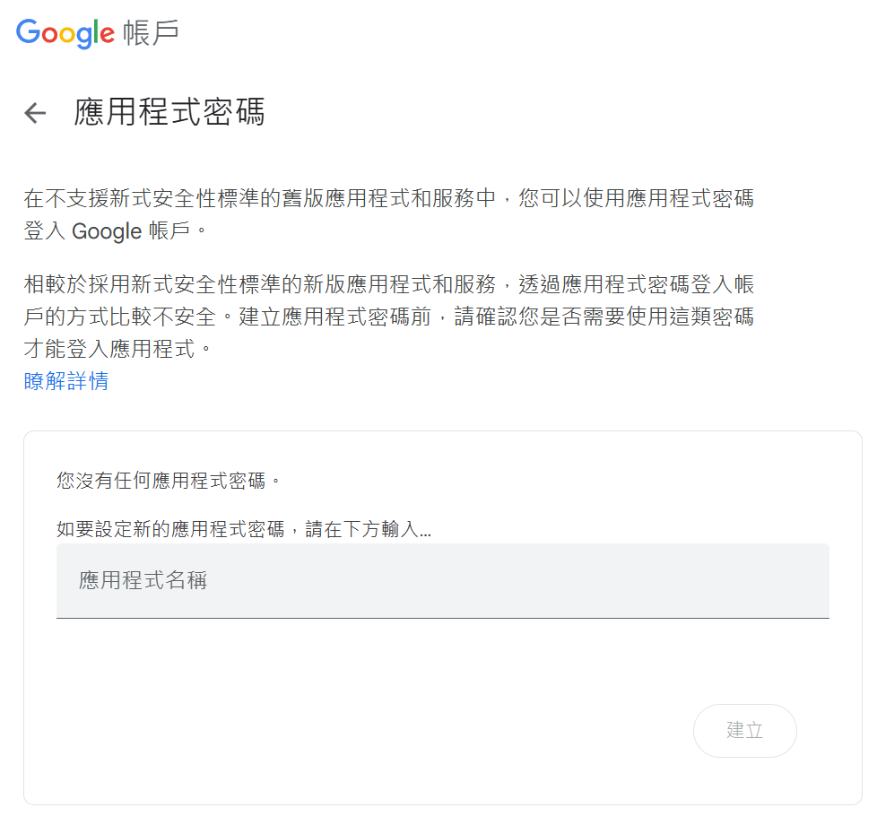
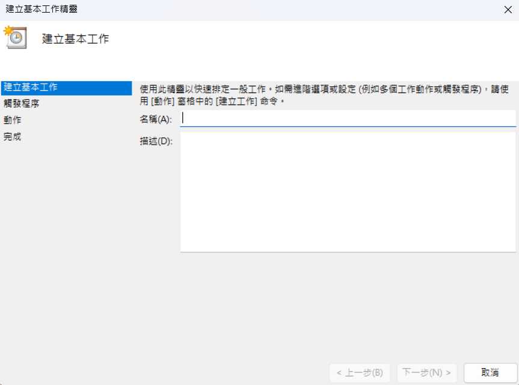
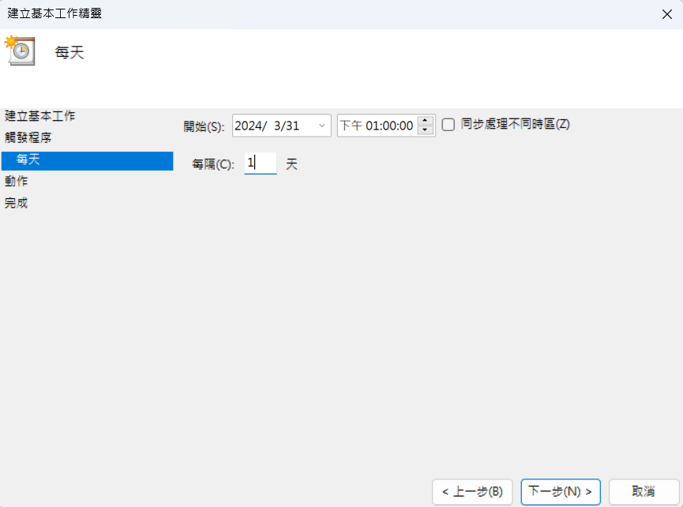
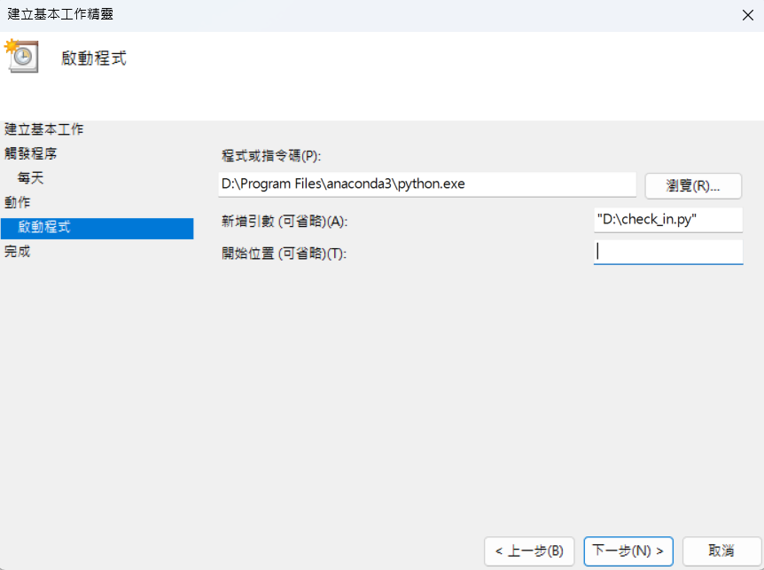

<h1 align="center"> NCU 人事自動簽到 [兼任助理/工讀生/臨時工]</h1>

<p align="center">  
<a title="Python 3.9" href="https://www.python.org/">
    
</a>
<a title="MIT License" href="LICENSE">
    
</a>
</p>

自動化簽到流程，透過執行 `auto_check_in.py` 完成 __定時簽到__，或透過 `check_in.py` 完成 __快速簽到__。

## 環境設置
請於裝有 Python 的機器中執行以下命令：
```bash 
pip install -r requirements.txt 
```

## 參數設置
請於 `config.json` 檔案中輸入相關參數，參數說明如下：  
- ```driver_path```：瀏覽器驅動程式絕對路徑，可於 [官方連結](https://developer.microsoft.com/zh-tw/microsoft-edge/tools/webdriver/ "官方驅動程式") 中下載。
    - 範例："D:\\\\Users\\\\user\\\\downloads\\\\"
- ```account```：中央大學 Portal 網站的帳號
    - 範例："112423000"
- ```passwd```：中央大學 Portal 網站的密碼
    - 範例："P@ssw0rd"
- ```case```：欲簽到的工作/計畫名稱
    - 範例："工讀：1122資管系課程助教1"
- ```work```：簽退時候填寫的工作內容
    - 範例："協助課程業務"
- ```work_dates```：可接受簽到的所有日期
    - 範例：["2024/4/2" , "2024/4/3" , "2024/4/4"]
- ```work_hour```：總共需要簽到時間 （單位：__小時__）
- ```max_hour_per_day```：每日最高工時（不可高於八小時）
- ```send_email```：是否需要郵件通知
- ```email_account```：電子郵件帳號（如未使用郵件通知，則不需設置）
- ```email_passwd```：電子郵件密碼（如未使用郵件通知，則不需設置）
- ```send_telegram_bot```: 是否需要 telegram_bot 通知
- ```telegram_bot_token``` :telegram_bot 的 API token
- ```telegram_chat_id``` : telegram bot 的 chat id
## 使用說明

### 定時簽到：
針對所有可接受簽到的日期，以 __每日最高工時__，在 __最短天數__ 內完成所有簽到。  
```bash 
python auto_check_in.py
```
_提示：如果不想要長時間執行程式，可使用下方的快速簽到功能。_ 

### 快速簽到：
直接進行簽到/簽退動作，可以結合 Linux（crontab）、Windows（任務管理器）來達成背景中執行。  
```bash 
python check_in.py
python check_out.py
```
    
## 注意事項
- 使用定時簽到時，__請勿將主執行緒關閉__，否則將無法執行自動簽到動作。
- 如需使用 Email 郵件通知，請 [__設定應用程式密碼__](https://myaccount.google.com/apppasswords "Google 應用程式密碼") 或 __取消兩步驟驗證功能__。

## 補充教學

### 新增 telegram bot
- telegram 搜尋欄搜尋  ```@BotFather``` 

- 按 ```/start```


- 創造機器人 ```/newbot```
    - 輸入機器人的name
    - 成功後即可獲得機器人的連結 & token 

 </br>

- 接下來輸入 `/mybots`
    - 選擇剛才創造的bot
    

- 切換到 `@yourbot`
        

### 設定應用程式密碼（Google）：
- 請先前往[此處](https://myaccount.google.com/apppasswords "Google 應用程式密碼")登入帳號後，請先輸入密碼名稱，點選 __建立__ 後，即會看到一組十六字元組成之密碼，請將其複製並貼於 ```email_passwd``` 欄位。  
<p align="center"></p>

### 設定 Windows 任務管理器：
1. 首先按住 ``Win+R`` 並輸入 ``taskschd.msc`` 打開任務排程器。

2. 於 __動作__ 列表中，點擊 __建立基本工作__，來新增排程 。

3. 首先先為此向排程 __建立名稱__（名稱自定義）。  
<p align="center"></p>

4. 接著選擇要執行任務的 __頻率、時間__ 。  
<p align="center"></p>

5. 最後於 __程式或指令碼__ 中輸入 python.exe 的檔案位置，以及於 __新增引數__ 中輸入快速簽到的檔案位置，如圖所示。
<p align="center"></p>

6. 點選完成，即完成排程任務。